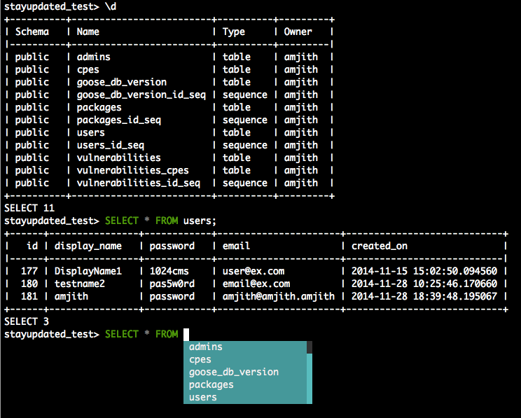

# The pgcli snap

This is a postgres client that does auto-completion and syntax highlighting.

<p align="center"><b>This is the snap for <a href="https://www.pgcli.com/">pgcli</a>.</b> It works on Ubuntu, Fedora, Debian, and other major Linux
distributions.</p>


<p align="center">Published for  with :gift_heart: by Khiem Doan</p>

Source: [https://github.com/dbcli/pgcli](https://github.com/dbcli/pgcli)

Chat: [Gitter](https://gitter.im/dbcli/pgcli/)

Mailing List: [https://groups.google.com/forum/#!forum/pgcli](https://groups.google.com/forum/#!forum/pgcli)




Quick Start
-----------

```
$ sudo snap install pgcli
```

### Usage

    $ pgcli --help

    Usage: pgcli [OPTIONS] [DBNAME] [USERNAME]

    Options:
      -h, --host TEXT         Host address of the postgres database.
      -p, --port INTEGER      Port number at which the postgres instance is
                              listening.
      -U, --username TEXT     Username to connect to the postgres database.
      -u, --user TEXT         Username to connect to the postgres database.
      -W, --password          Force password prompt.
      -w, --no-password       Never prompt for password.
      --single-connection     Do not use a separate connection for completions.
      -v, --version           Version of pgcli.
      -d, --dbname TEXT       database name to connect to.
      --pgclirc PATH          Location of pgclirc file.
      -D, --dsn TEXT          Use DSN configured into the [alias_dsn] section of
                              pgclirc file.
      --list-dsn              list of DSN configured into the [alias_dsn] section
                              of pgclirc file.
      --row-limit INTEGER     Set threshold for row limit prompt. Use 0 to disable
                              prompt.
      --less-chatty           Skip intro on startup and goodbye on exit.
      --prompt TEXT           Prompt format (Default: "\u@\h:\d> ").
      --prompt-dsn TEXT       Prompt format for connections using DSN aliases
                              (Default: "\u@\h:\d> ").
      -l, --list              list available databases, then exit.
      --auto-vertical-output  Automatically switch to vertical output mode if the
                              result is wider than the terminal width.
      --warn / --no-warn      Warn before running a destructive query.
      --help                  Show this message and exit.

Features
--------

The `pgcli` is written using prompt_toolkit_.

* Auto-completes as you type for SQL keywords as well as tables and
  columns in the database.
* Syntax highlighting using Pygments.
* Smart-completion (enabled by default) will suggest context-sensitive
  completion.

    - ``SELECT * FROM <tab>`` will only show table names.
    - ``SELECT * FROM users WHERE <tab>`` will only show column names.

* Primitive support for ``psql`` back-slash commands.
* Pretty prints tabular data.

.. _prompt_toolkit: https://github.com/jonathanslenders/python-prompt-toolkit
.. _tabulate: https://pypi.python.org/pypi/tabulate

Config
------
A config file is automatically created at ``~/.config/pgcli/config`` at first launch.
See the file itself for a description of all available options.

Contributions:
--------------

If you're interested in contributing to this project, first of all I would like
to extend my heartfelt gratitude. I've written a small doc to describe how to
get this running in a development setup.

https://github.com/dbcli/pgcli/blob/master/DEVELOP.rst

Thanks:
-------

A special thanks to `Jonathan Slenders <https://twitter.com/jonathan_s>`_ for
creating `Python Prompt Toolkit <http://github.com/jonathanslenders/python-prompt-toolkit>`_,
which is quite literally the backbone library, that made this app possible.
Jonathan has also provided valuable feedback and support during the development
of this app.

`Click <http://click.pocoo.org/>`_ is used for command line option parsing
and printing error messages.

Thanks to `psycopg <http://initd.org/psycopg/>`_ for providing a rock solid
interface to Postgres database.

Thanks to all the beta testers and contributors for your time and patience. :)
